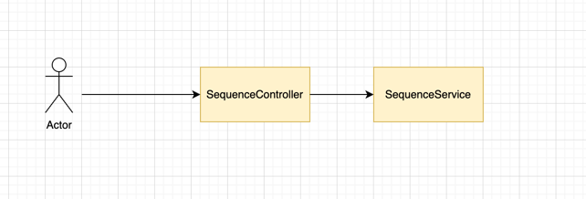

## Usage
 
Para correr la aplicacion es necesario ejecutar esta clase SequenceServiceApplication

Cuando la aplicacion este arriba, executar esta cUrl

curl --location 'http://localhost:8080/sequence' \
--header 'Content-Type: application/json' \
--data '{
"value1" : "babgbag",
"value2" : "bag"
}'

## Deploy process

Ya que se necesita desplegar este microservicio a produccion,
1. Le crearia un DockerFile a la aplicacion,
2. Se le hace el build a el docker
3. Subimos la imagen a Docker Hub
4. Luego de tener la imagen arriba
5. Ya sea en una VM o en algun Cloud provider
6. Descargamos la imagen y desplegamos esta

## Diagram

